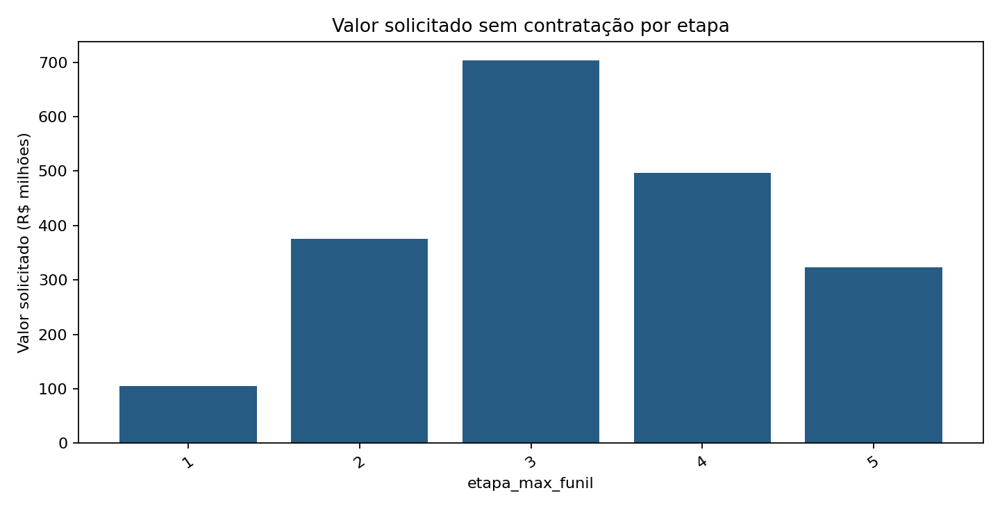
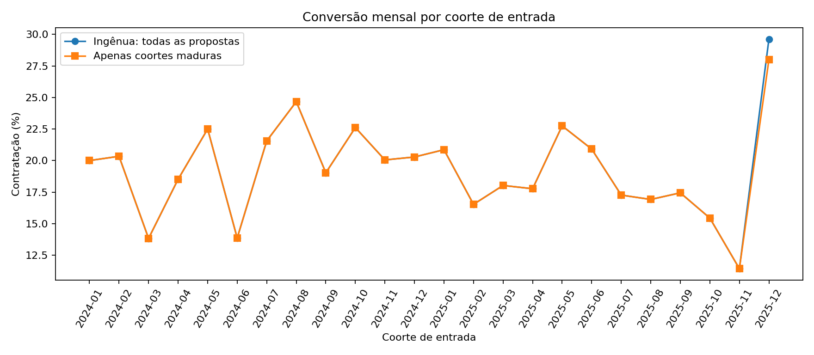
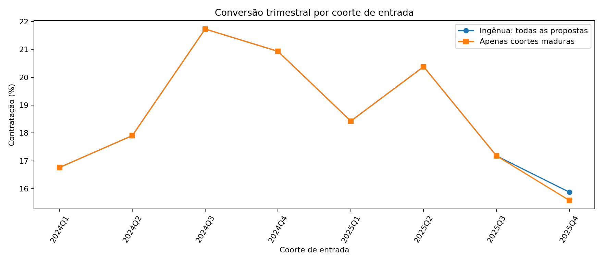
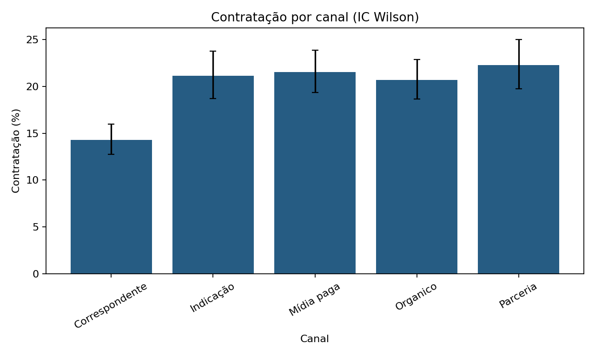

# Diagnóstico do funil — Parte 1

Valores em R$ representam **crédito solicitado potencial**, não receita nem lucro realizado. As propostas sintéticas não permitem inferir causalidade.

Base: N=6400 propostas; contratos=1241/6400 (19,39%). A base tratada manteve todos os registros; indicadores de qualidade permanecem como flags.

## 1. Onde se concentra o valor sem contratação

O estágio atribuído é a **etapa máxima atingida**, não uma medida do valor gerado na etapa. Não se conhece margem, receita ou probabilidade contrafactual de contratação.

### Todos os status não contratados

| etapa_max_funil | status_final | propostas | valor_solicitado | ticket_medio |
| --- | --- | --- | --- | --- |
| 1 | Desistiu | 136 | R$ 52.248.439,74 | R$ 384.179,70 |
| 1 | Sem retorno | 137 | R$ 52.302.055,43 | R$ 381.766,83 |
| 2 | Desistiu | 346 | R$ 136.889.653,36 | R$ 395.634,84 |
| 2 | Reprovada crédito | 312 | R$ 120.888.375,41 | R$ 387.462,74 |
| 2 | Sem retorno | 326 | R$ 117.208.787,86 | R$ 359.536,16 |
| 3 | Desistiu | 614 | R$ 243.107.565,29 | R$ 395.940,66 |
| 3 | Reprovada crédito | 608 | R$ 231.342.027,26 | R$ 380.496,76 |
| 3 | Sem retorno | 577 | R$ 228.596.887,55 | R$ 396.181,78 |
| 4 | Problema garantia | 668 | R$ 263.775.666,08 | R$ 394.873,75 |
| 4 | Sem retorno | 599 | R$ 233.214.084,10 | R$ 389.339,04 |
| 5 | Desistiu | 396 | R$ 153.852.714,60 | R$ 388.516,96 |
| 5 | Documentação pendente | 440 | R$ 168.940.236,77 | R$ 383.955,08 |

Total: 5159/6400 propostas sem contratação, R$ 2.002.366.493,45 solicitados. A etapa 3 concentra 1799/5159 dessas propostas e R$ 703.046.480,10 (35,11% do valor).

### Sem contar `Sem retorno` e `Desistiu` como perdas

| etapa_max_funil | status_final | propostas | valor_solicitado | ticket_medio |
| --- | --- | --- | --- | --- |
| 2 | Reprovada crédito | 312 | R$ 120.888.375,41 | R$ 387.462,74 |
| 3 | Reprovada crédito | 608 | R$ 231.342.027,26 | R$ 380.496,76 |
| 4 | Problema garantia | 668 | R$ 263.775.666,08 | R$ 394.873,75 |
| 5 | Documentação pendente | 440 | R$ 168.940.236,77 | R$ 383.955,08 |

Nesse enquadramento, 2028/6400 propostas somam R$ 784.946.305,52; a etapa 4 lidera com 668/2028 propostas e R$ 263.775.666,08 (33,60% do valor deste cenário). `Sem retorno` pode estar aberto; `Desistiu` pode ser perda final ou recuperável. `Documentação pendente` também pode estar aberta neste segundo cenário. Não há data ou regra de encerramento para decidir.

## 2. Percepção da liderança

**Maturação.** Mediana de `tempo_analise_dias`=31 dias (N=6400); percentil 90=47 dias (N=6400). Sem data de extração, o corte **proxy** é o maior `data_entrada + tempo_analise_dias`: 2026-02-04. Só se considera madura a proposta com ao menos 47 dias até esse corte. É uma restrição de exposição, não uma correção estatística identificada de censura; o tempo de análise dos casos ainda abertos pode não representar seu futuro desfecho.

### Coortes mensais: ingênua e apenas maduras

| coorte | N total | contratos total | taxa ingênua | N maduro | contratos maduros | taxa madura |
| --- | --- | --- | --- | --- | --- | --- |
| 2024-01 | 20 | 4 | 20,00% | 20 | 4 | 20,00% |
| 2024-02 | 59 | 12 | 20,34% | 59 | 12 | 20,34% |
| 2024-03 | 94 | 13 | 13,83% | 94 | 13 | 13,83% |
| 2024-04 | 135 | 25 | 18,52% | 135 | 25 | 18,52% |
| 2024-05 | 160 | 36 | 22,50% | 160 | 36 | 22,50% |
| 2024-06 | 202 | 28 | 13,86% | 202 | 28 | 13,86% |
| 2024-07 | 269 | 58 | 21,56% | 269 | 58 | 21,56% |
| 2024-08 | 300 | 74 | 24,67% | 300 | 74 | 24,67% |
| 2024-09 | 310 | 59 | 19,03% | 310 | 59 | 19,03% |
| 2024-10 | 367 | 83 | 22,62% | 367 | 83 | 22,62% |
| 2024-11 | 394 | 79 | 20,05% | 394 | 79 | 20,05% |
| 2024-12 | 424 | 86 | 20,28% | 424 | 86 | 20,28% |
| 2025-01 | 465 | 97 | 20,86% | 465 | 97 | 20,86% |
| 2025-02 | 484 | 80 | 16,53% | 484 | 80 | 16,53% |
| 2025-03 | 527 | 95 | 18,03% | 527 | 95 | 18,03% |
| 2025-04 | 439 | 78 | 17,77% | 439 | 78 | 17,77% |
| 2025-05 | 400 | 91 | 22,75% | 400 | 91 | 22,75% |
| 2025-06 | 373 | 78 | 20,91% | 373 | 78 | 20,91% |
| 2025-07 | 307 | 53 | 17,26% | 307 | 53 | 17,26% |
| 2025-08 | 266 | 45 | 16,92% | 266 | 45 | 16,92% |
| 2025-09 | 172 | 30 | 17,44% | 172 | 30 | 17,44% |
| 2025-10 | 136 | 21 | 15,44% | 136 | 21 | 15,44% |
| 2025-11 | 70 | 8 | 11,43% | 70 | 8 | 11,43% |
| 2025-12 | 27 | 8 | 29,63% | 25 | 7 | 28,00% |

### Coortes trimestrais: ingênua e apenas maduras

| coorte | N total | contratos total | taxa ingênua | N maduro | contratos maduros | taxa madura |
| --- | --- | --- | --- | --- | --- | --- |
| 2024Q1 | 173 | 29 | 16,76% | 173 | 29 | 16,76% |
| 2024Q2 | 497 | 89 | 17,91% | 497 | 89 | 17,91% |
| 2024Q3 | 879 | 191 | 21,73% | 879 | 191 | 21,73% |
| 2024Q4 | 1185 | 248 | 20,93% | 1185 | 248 | 20,93% |
| 2025Q1 | 1476 | 272 | 18,43% | 1476 | 272 | 18,43% |
| 2025Q2 | 1212 | 247 | 20,38% | 1212 | 247 | 20,38% |
| 2025Q3 | 745 | 128 | 17,18% | 745 | 128 | 17,18% |
| 2025Q4 | 233 | 37 | 15,88% | 231 | 36 | 15,58% |

O filtro proxy retira 2/6400 propostas recentes; curvas muito próximas não validam a ausência de censura real.

Comparação predefinida entre os dois semestres de 2025 **somente entre maduras**: 519/2688 (19,31%) no primeiro e 164/976 (16,80%) no segundo; diferença=-2.50 pontos percentuais, qui-quadrado p=0.08524. O sentido da diferença é descritivo; múltiplas comparações exploratórias e o corte proxy reduzem a confiança.

### Canal

| grupo | N | contratos | taxa | IC inferior | IC superior |
| --- | --- | --- | --- | --- | --- |
| Correspondente | 1772 | 253 | 14,28% | 12,73% | 15,98% |
| Indicação | 980 | 207 | 21,12% | 18,68% | 23,79% |
| Mídia paga | 1272 | 274 | 21,54% | 19,37% | 23,88% |
| Organico | 1411 | 292 | 20,69% | 18,66% | 22,89% |
| Parceria | 965 | 215 | 22,28% | 19,77% | 25,01% |

Mix observado de Correspondente e demais canais (cada proporção usa o N da linha):

| grupo | N | LTV médio | score médio | acima do teto | Terreno | UF SP |
| --- | --- | --- | --- | --- | --- | --- |
| Correspondente | 1772 | 0.490 | 654.8 | 14,84% | 8,18% | 25,85% |
| Demais | 4628 | 0.491 | 675.1 | 15,51% | 8,43% | 25,71% |

Qui-quadrado global, N=6400, canais=5, p=1.694e-08. Correspondente: 253/1772; demais canais: 988/4628; diferença bruta=-7.07 pp. Modelo ajustado por LTV, score, tipo de imóvel e UF: N=6400/6400, OR Correspondente vs. demais=0.677 (IC 95% 0.581–0.790; p=6.827e-07); diferença média padronizada=-5.52 pp. A mudança entre diferença bruta e ajustada sugere contribuição do mix observado; diferença residual pode refletir fatores não medidos, não efeito causal do canal.

### Veredito

Queda recente: direção negativa entre maduras (2688 e 976 propostas nos períodos; p=0.08524), com **confiança baixa** para afirmar uma queda sustentada: corte de extração desconhecido e `Sem retorno` ambíguo. Correspondente: taxa menor no total (1772 vs. 4628 propostas), ainda associada a menor contratação após ajuste (N=6400, IC ajustado acima); **confiança média** na associação observacional. O pedido de entender 'onde se perde dinheiro' deve ser refinado para valor solicitado, pois não há margem ou receita.

## 3. Características associadas à contratação

Taxas univariadas: N e contratos são os denominadores de cada faixa; quartis foram derivados desta base.

### canal

| grupo | N | contratos | taxa | IC inferior | IC superior |
| --- | --- | --- | --- | --- | --- |
| Correspondente | 1772 | 253 | 14,28% | 12,73% | 15,98% |
| Indicação | 980 | 207 | 21,12% | 18,68% | 23,79% |
| Mídia paga | 1272 | 274 | 21,54% | 19,37% | 23,88% |
| Organico | 1411 | 292 | 20,69% | 18,66% | 22,89% |
| Parceria | 965 | 215 | 22,28% | 19,77% | 25,01% |

### LTV

| grupo | N | contratos | taxa | IC inferior | IC superior |
| --- | --- | --- | --- | --- | --- |
| (-∞; 0,40] | 1259 | 259 | 20,57% | 18,43% | 22,89% |
| (0,40; 0,50] | 2144 | 494 | 23,04% | 21,31% | 24,87% |
| (0,50; 0,60] | 2016 | 364 | 18,06% | 16,44% | 19,79% |
| (0,60; +∞] | 981 | 124 | 12,64% | 10,71% | 14,87% |

### tipo de imóvel

| grupo | N | contratos | taxa | IC inferior | IC superior |
| --- | --- | --- | --- | --- | --- |
| Apartamento | 2745 | 533 | 19,42% | 17,98% | 20,94% |
| Casa | 2077 | 379 | 18,25% | 16,65% | 19,97% |
| Imóvel rural | 248 | 50 | 20,16% | 15,64% | 25,59% |
| Sala comercial | 795 | 166 | 20,88% | 18,20% | 23,84% |
| Terreno | 535 | 113 | 21,12% | 17,87% | 24,78% |

### score (quartis)

| grupo | N | contratos | taxa | IC inferior | IC superior |
| --- | --- | --- | --- | --- | --- |
| (360,00; 618,00] | 1628 | 183 | 11,24% | 9,80% | 12,87% |
| (618,00; 669,00] | 1594 | 267 | 16,75% | 15,00% | 18,66% |
| (669,00; 721,00] | 1594 | 324 | 20,33% | 18,42% | 22,37% |
| (721,00; 990,00] | 1584 | 467 | 29,48% | 27,29% | 31,78% |

### ticket (quartis)

| grupo | N | contratos | taxa | IC inferior | IC superior |
| --- | --- | --- | --- | --- | --- |
| (45707,69; 236328,23] | 1600 | 333 | 20,81% | 18,89% | 22,87% |
| (236328,23; 337237,82] | 1600 | 337 | 21,06% | 19,14% | 23,13% |
| (337237,82; 478112,90] | 1600 | 291 | 18,19% | 16,37% | 20,15% |
| (478112,90; 2280018,30] | 1600 | 280 | 17,50% | 15,72% | 19,44% |

### UF

| grupo | N | contratos | taxa | IC inferior | IC superior |
| --- | --- | --- | --- | --- | --- |
| BA | 521 | 100 | 19,19% | 16,04% | 22,80% |
| DF | 521 | 111 | 21,31% | 18,01% | 25,02% |
| GO | 522 | 122 | 23,37% | 19,94% | 27,19% |
| MG | 503 | 103 | 20,48% | 17,18% | 24,22% |
| PE | 564 | 102 | 18,09% | 15,13% | 21,47% |
| PR | 516 | 91 | 17,64% | 14,59% | 21,16% |
| RJ | 558 | 98 | 17,56% | 14,63% | 20,94% |
| RS | 540 | 96 | 17,78% | 14,78% | 21,23% |
| SC | 507 | 90 | 17,75% | 14,67% | 21,32% |
| SP | 1648 | 328 | 19,90% | 18,05% | 21,90% |

### cidade

| grupo | N | contratos | taxa | IC inferior | IC superior |
| --- | --- | --- | --- | --- | --- |
| Belo Horizonte | 503 | 103 | 20,48% | 17,18% | 24,22% |
| Brasília | 521 | 111 | 21,31% | 18,01% | 25,02% |
| Campinas | 566 | 124 | 21,91% | 18,70% | 25,50% |
| Curitiba | 516 | 91 | 17,64% | 14,59% | 21,16% |
| Florianópolis | 507 | 90 | 17,75% | 14,67% | 21,32% |
| Goiânia | 522 | 122 | 23,37% | 19,94% | 27,19% |
| Porto Alegre | 540 | 96 | 17,78% | 14,78% | 21,23% |
| Recife | 564 | 102 | 18,09% | 15,13% | 21,47% |
| Rio de Janeiro | 558 | 98 | 17,56% | 14,63% | 20,94% |
| Salvador | 521 | 100 | 19,19% | 16,04% | 22,80% |
| Santos | 541 | 106 | 19,59% | 16,47% | 23,15% |
| São Paulo | 541 | 98 | 18,11% | 15,10% | 21,58% |

### prazo

| grupo | N | contratos | taxa | IC inferior | IC superior |
| --- | --- | --- | --- | --- | --- |
| (0,00; 84,00] | 2629 | 498 | 18,94% | 17,49% | 20,49% |
| (84,00; 120,00] | 1264 | 249 | 19,70% | 17,60% | 21,98% |
| (120,00; 180,00] | 1293 | 243 | 18,79% | 16,76% | 21,01% |
| (180,00; +∞] | 1214 | 251 | 20,68% | 18,49% | 23,04% |

### idade

| grupo | N | contratos | taxa | IC inferior | IC superior |
| --- | --- | --- | --- | --- | --- |
| (0,00; 29,00] | 851 | 161 | 18,92% | 16,43% | 21,69% |
| (29,00; 44,00] | 3304 | 630 | 19,07% | 17,76% | 20,44% |
| (44,00; 59,00] | 2069 | 417 | 20,15% | 18,48% | 21,94% |
| (59,00; +∞] | 176 | 33 | 18,75% | 13,67% | 25,16% |

### renda (quartis)

| grupo | N | contratos | taxa | IC inferior | IC superior |
| --- | --- | --- | --- | --- | --- |
| (1800,00; 3630,49] | 1600 | 296 | 18,50% | 16,67% | 20,48% |
| (3630,49; 5206,99] | 1600 | 289 | 18,06% | 16,25% | 20,02% |
| (5206,99; 7400,56] | 1600 | 336 | 21,00% | 19,07% | 23,06% |
| (7400,56; 35231,29] | 1600 | 320 | 20,00% | 18,11% | 22,03% |

### recorrência

| grupo | N | contratos | taxa | IC inferior | IC superior |
| --- | --- | --- | --- | --- | --- |
| 0 | 5174 | 953 | 18,42% | 17,39% | 19,50% |
| 1 | 1226 | 288 | 23,49% | 21,20% | 25,94% |

### Regressão logística multivariável

N=6400/6400 propostas completas para as variáveis do modelo; evento=contratação. Referências explícitas na tabela. OR numérico por incremento descrito; IC Wald condicionado ao modelo. A implementação minimiza a log-verossimilhança binomial com `scipy.optimize` e calcula o erro padrão pela inversa da informação observada. Sem ajuste por dependência entre propostas do mesmo consultor.

| variável / contraste | OR | IC inferior | IC superior | p Wald |
| --- | --- | --- | --- | --- |
| ltv +0.10 | 0.841 | 0.788 | 0.899 | 2.741e-07 |
| score +100 | 1.808 | 1.657 | 1.972 | 1.247e-40 |
| ticket +R$100 mil | 0.987 | 0.954 | 1.020 | 0.4305 |
| prazo +12 meses | 1.004 | 0.993 | 1.016 | 0.4626 |
| idade +10 anos | 1.035 | 0.970 | 1.104 | 0.2994 |
| renda +R$1 mil | 1.003 | 0.984 | 1.022 | 0.751 |
| flag_cliente_recorrente | 1.379 | 1.182 | 1.608 | 4.235e-05 |
| canal_origem=Correspondente (ref. Organico) | 0.710 | 0.587 | 0.858 | 0.0004048 |
| canal_origem=Indicação (ref. Organico) | 1.056 | 0.860 | 1.296 | 0.6048 |
| canal_origem=Mídia paga (ref. Organico) | 1.042 | 0.862 | 1.260 | 0.6691 |
| canal_origem=Parceria (ref. Organico) | 1.107 | 0.903 | 1.358 | 0.3272 |
| tipo_imovel=Casa (ref. Apartamento) | 0.952 | 0.819 | 1.105 | 0.5166 |
| tipo_imovel=Imóvel rural (ref. Apartamento) | 1.061 | 0.761 | 1.479 | 0.7283 |
| tipo_imovel=Sala comercial (ref. Apartamento) | 1.095 | 0.896 | 1.339 | 0.3748 |
| tipo_imovel=Terreno (ref. Apartamento) | 1.149 | 0.909 | 1.452 | 0.2454 |
| uf=BA (ref. SP) | 0.947 | 0.733 | 1.223 | 0.6742 |
| uf=DF (ref. SP) | 1.080 | 0.843 | 1.384 | 0.5431 |
| uf=GO (ref. SP) | 1.195 | 0.938 | 1.522 | 0.1504 |
| uf=MG (ref. SP) | 1.015 | 0.787 | 1.309 | 0.9112 |
| uf=PE (ref. SP) | 0.928 | 0.722 | 1.194 | 0.5631 |
| uf=PR (ref. SP) | 0.847 | 0.651 | 1.102 | 0.2153 |
| uf=RJ (ref. SP) | 0.859 | 0.665 | 1.108 | 0.2416 |
| uf=RS (ref. SP) | 0.884 | 0.684 | 1.144 | 0.3487 |
| uf=SC (ref. SP) | 0.877 | 0.674 | 1.142 | 0.3289 |

Gradiente final máximo: 1.8e-06 (modelo completo); 1.9e-06 (canal ajustado). A forma linear no logit, correlação entre covariáveis e confundimento residual limitam interpretação. Associação **não** demonstra causalidade.

## Sensibilidade das decisões

| cenário | N | contratos | taxa total | N antes | N depois | taxa antes | taxa depois | diferença recente (pp) | N corr. | N outros | diferença corr. (pp) | OR corr. ajustado | etapa maior valor |
| --- | --- | --- | --- | --- | --- | --- | --- | --- | --- | --- | --- | --- | --- |
| Base: todos / Sem retorno como perda | 6400 | 1241 | 19,39% | 2688 | 976 | 19,31% | 16,80% | -2.50 | 1772 | 4628 | -7.07 | 0.677 | 3 |
| Sem Terreno | 5865 | 1128 | 19,23% | 2453 | 904 | 19,00% | 16,81% | -2.18 | 1627 | 4238 | -7.65 | 0.641 | 3 |
| Somente LTV <= teto | 5419 | 1117 | 20,61% | 2278 | 814 | 21,03% | 17,57% | -3.46 | 1509 | 3910 | -6.89 | 0.699 | 3 |
| Sem retorno em aberto (fora do denominador) | 4761 | 1241 | 26,07% | 1978 | 701 | 26,24% | 23,40% | -2.84 | 1273 | 3488 | -8.45 | 0.694 | 3 |

Entre os 4 cenários, o sinal da diferença recente é sempre negativo e o de Correspondente é sempre negativo; o OR ajustado de Correspondente é menor que 1 em todos; a etapa de maior valor permanece a mesma (N por cenário: 6400, 5865, 5419, 4761). Se `Sem retorno` **e** `Desistiu` forem retirados juntos, a etapa líder passa a 4 (2028/6400 propostas no cenário). A força estatística e a interpretação de status aberto ainda dependem da definição de desfecho.

Contratos acima do teto de LTV: 124/1241; o cenário sem esses casos remove 981/6400 propostas, apenas para sensibilidade. `Sem retorno` em aberto sai do denominador de conversão, mas permanece no valor em acompanhamento. Cada cenário é isolado, não acumulado.

## 4. Recomendações priorizadas: cenários, não previsões

Elegibilidade dos cenários: LTV até o teto, etapa válida e idade não suspeita; as três populações por status não se sobrepõem. Recuperações parametrizadas não são efeitos medidos. O R$ é soma proporcional do crédito solicitado, nunca receita projetada.

| prioridade e ação | N elegível | valor elegível | premissa de recuperação | contratos esperados | R$ solicitado esperado | hipótese / validação |
| --- | --- | --- | --- | --- | --- | --- |
| 1. Retomar propostas sem retorno | 1375 | R$ 495.656.187,13 | 8,00% | 110.00 | R$ 39.652.494,97 | Contato estruturado resolve uma fração parametrizada dos casos; testar abordagem aleatorizada. |
| 2. Destravar documentação pendente | 378 | R$ 138.242.596,42 | 15,00% | 56.70 | R$ 20.736.389,46 | Checklist e apoio documental convertem uma fração parametrizada; testar por equipe/rodízio. |
| 3. Investigar desistência de correspondentes | 365 | R$ 136.426.521,74 | 5,00% | 18.25 | R$ 6.821.326,09 | Revisão de atendimento recupera uma fração parametrizada; comparar grupos de correspondentes. |

Validação sugerida: definir status de encerramento e prazo de acompanhamento; medir contratos adicionais por grupo comparável com sorteio ou implantação escalonada, inclusive custo operacional e aprovação de crédito. Não implementar contratação acima da política.

## Limites de confiança

Data de extração ausente (N=6400); status incertos somam 3131/6400; contratos com LTV acima da política somam 124/1241. Essas três lacunas dominam a incerteza. Valores monetários não são perdas financeiras realizadas.
